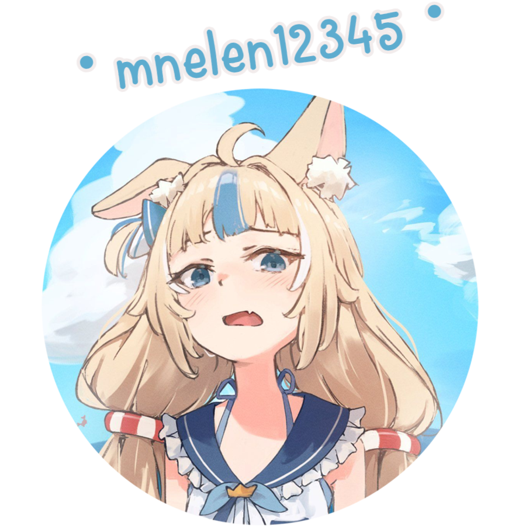
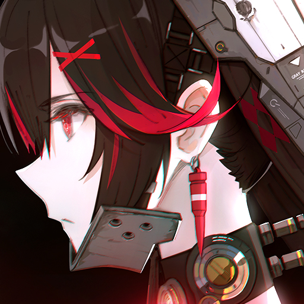
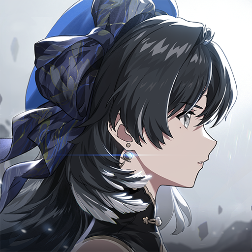
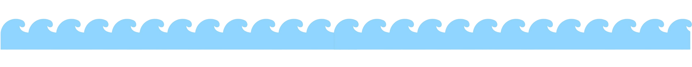

    

    

> [!NOTE]
> trying something 
<!--

    

-->
- I enjoy rhythm & gacha games, playing casually from time to time 
  ↳ **Main games:** 
   [osu!](https://osu.ppy.sh/) 
   [Punishing: Gray Raven](https://pgr.kurogame.net/) 
   [Wuthering Waves](https://wutheringwaves.kurogame.com/) 
  ↳ **Mabe:** 
   [Minecraft](https://minecraft.net) 
   [Genshin Impact](https://genshin.hoyoverse.com/) 
   [Honkai: Star Rail](https://hsr.hoyoverse.com/) 

    

    

     
  

    

