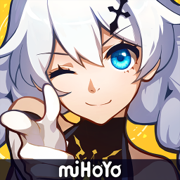

  

- I enjoy playing  <a href="https://osu.ppy.sh/" style="text-decoration: none;">osu!</a>, 
 <a href="https://genshin.hoyoverse.com/" style="text-decoration: none;">Genshin Impact</a>, 
 <a href="https://honkaiimpact3.hoyoverse.com/global/" style="text-decoration: none;">HI3rd</a>, 
 <a href="https://hsr.hoyoverse.com/" style="text-decoration: none;">Honkai: Star Rail</a>, 
 <a href="https://www.strinova.com/" style="text-decoration: none;">Strinova</a>
- I have experience with  HTML,  CSS,  Python,  Linux,  Krita

### Discord

### Contact me
[Discord](https://discordapp.com/users/954702228789268512) | [Telegram](https://t.me/mnelen12345)
